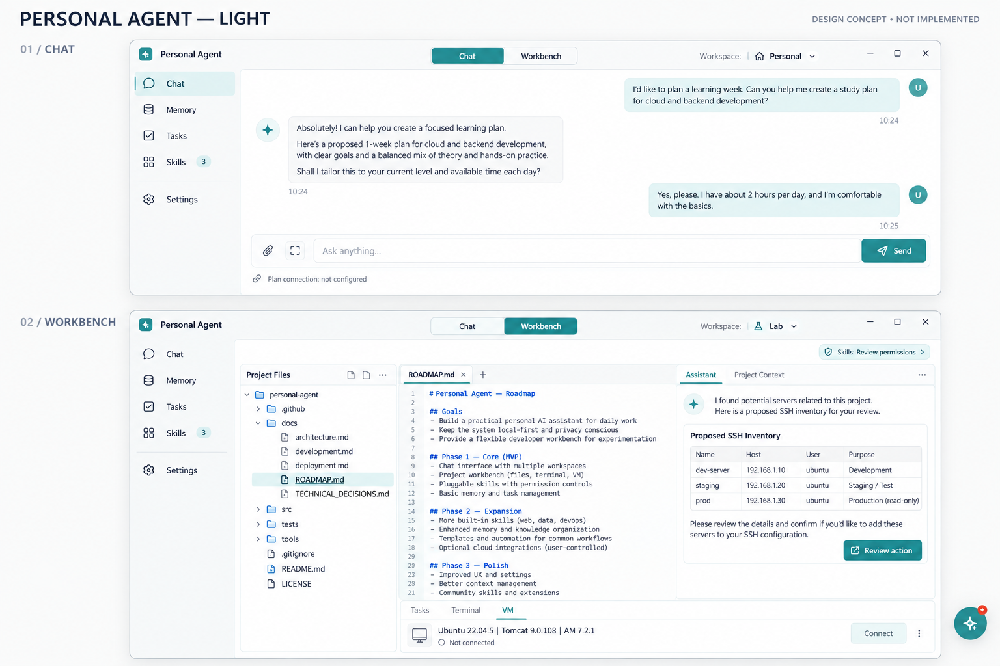
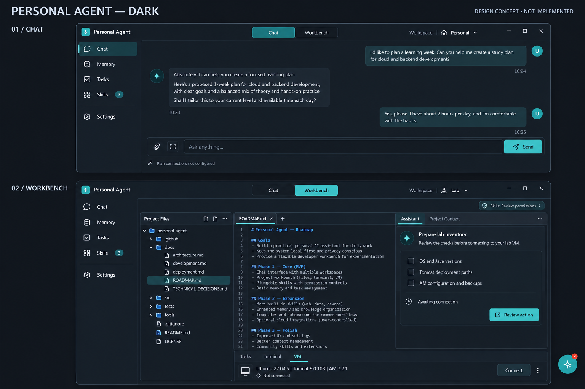

# UI design concepts / 界面设计概念图

Original light and dark design concepts discussed before implementation. Each board includes the simple Chat mode and compact Workbench mode.

These are AI-generated PNG concept boards, not editable Figma (.fig) files or screenshots of shipped functionality. Text, sample hosts and records in the images are illustrative. The current application implements only part of this direction; see the roadmap for pending features.

这两张是此前讨论的浅色、深色 UI 概念图，每张均包含聊天和工作台模式。它们是 PNG 图片，不是可编辑的 Figma 文件，也不代表所有功能已经实现。

## Light / 浅色

## Dark / 深色

